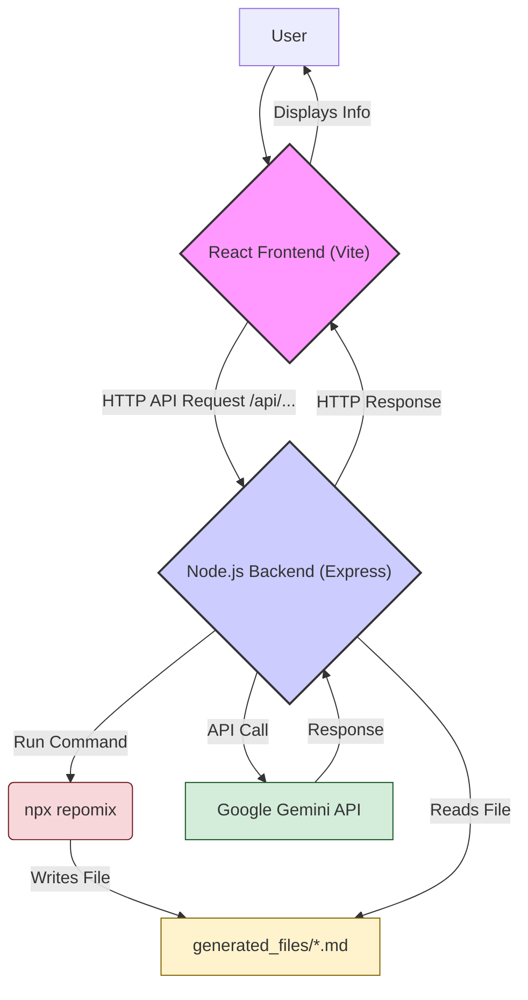
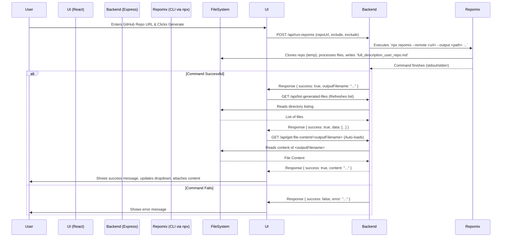
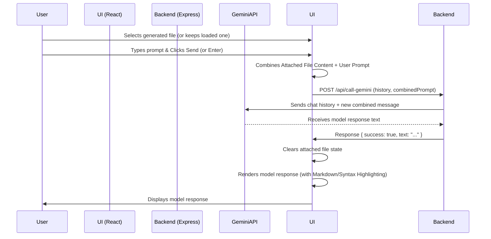

# Gemini Repomix Assistant

 <!-- Add other relevant badges: build status, coverage, etc. -->

A web application that leverages Google's Gemini Pro API and the `repomix` tool to enable conversational interactions with the content of GitHub repositories. Generate a concise representation of a codebase and then chat with Gemini to understand, analyze, or query it.

---

## Table of Contents

*   [Features](#features)
*   [Architecture](#architecture)
    *   [High-Level Overview](#high-level-overview)
    *   [Repomix Generation Flow](#repomix-generation-flow)
    *   [Chat Interaction Flow](#chat-interaction-flow)
*   [Prerequisites](#prerequisites)
*   [Setup](#setup)
    *   [Backend](#backend)
    *   [Frontend](#frontend)
*   [Running the Application](#running-the-application)
    *   [Backend Server](#backend-server)
    *   [Frontend Dev Server](#frontend-dev-server)
*   [Usage](#usage)
*   [Environment Variables](#environment-variables)
*   [Technology Stack](#technology-stack)
*   [Contributing](#contributing)
*   [License](#license)

---

## Features

*   **Repository Description Generation:** Enter a GitHub repository URL to generate a packed description file using `repomix`.
*   **Customizable Filtering:** Specify include/exclude file patterns for `repomix` generation.
*   **Description File Management:**
    *   Lists previously generated repository description files.
    *   Allows selecting a generated file to load its content.
    *   Automatically loads newly generated files.
*   **Context-Aware Chat:** Interact with Google's Gemini Pro API. The content of the selected/generated repository description file is automatically included as context in the conversation.
*   **Chat History:** Maintains conversation history within a session (limited turns sent to API for efficiency).
*   **Markdown & Syntax Highlighting:** Renders model responses with Markdown formatting and syntax highlighting for code blocks using Shikiji.
*   **Responsive UI:** Clean interface built with React and TypeScript.
*   **Clear Backend/Frontend Separation:** Node.js/Express backend handles API calls and `repomix` execution, while the React frontend manages the user interface.
*   **Auto-Resizing Input:** Chat input area expands automatically for multi-line messages.

---

## Architecture

The application consists of a React frontend and a Node.js backend.

### High-Level Overview

