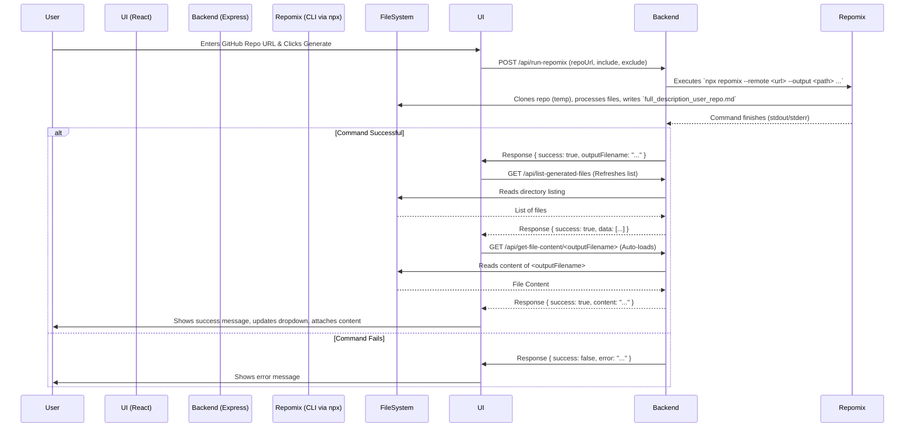
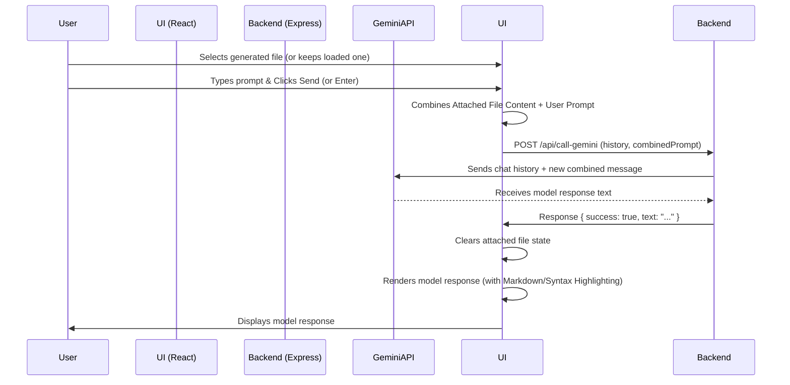

Okay, here is a professional README.md draft for your "Gemini Repomix Assistant" project, based on the provided code structure and functionality. It includes setup instructions, usage guide, feature list, and Mermaid diagrams for architecture visualization.

```markdown
# Gemini Repomix Assistant

[](https://opensource.org/licenses/MIT) <!-- Add other relevant badges: build status, coverage, etc. -->

A web application that leverages Google's Gemini Pro API and the `repomix` tool to enable conversational interactions with the content of GitHub repositories. Generate a concise representation of a codebase and then chat with Gemini to understand, analyze, or query it.

---

## Table of Contents

*   [Features](#features)
*   [Architecture](#architecture)
    *   [High-Level Overview](#high-level-overview)
    *   [Repomix Generation Flow](#repomix-generation-flow)
    *   [Chat Interaction Flow](#chat-interaction-flow)
*   [Prerequisites](#prerequisites)
*   [Setup](#setup)
    *   [Backend](#backend)
    *   [Frontend](#frontend)
*   [Running the Application](#running-the-application)
    *   [Backend Server](#backend-server)
    *   [Frontend Dev Server](#frontend-dev-server)
*   [Usage](#usage)
*   [Environment Variables](#environment-variables)
*   [Technology Stack](#technology-stack)
*   [Contributing](#contributing)
*   [License](#license)

---

## Features

*   **Repository Description Generation:** Enter a GitHub repository URL to generate a packed description file using `repomix`.
*   **Customizable Filtering:** Specify include/exclude file patterns for `repomix` generation.
*   **Description File Management:**
    *   Lists previously generated repository description files.
    *   Allows selecting a generated file to load its content.
    *   Automatically loads newly generated files.
*   **Context-Aware Chat:** Interact with Google's Gemini Pro API. The content of the selected/generated repository description file is automatically included as context in the conversation.
*   **Chat History:** Maintains conversation history within a session (limited turns sent to API for efficiency).
*   **Markdown & Syntax Highlighting:** Renders model responses with Markdown formatting and syntax highlighting for code blocks using Shikiji.
*   **Responsive UI:** Clean interface built with React and TypeScript.
*   **Clear Backend/Frontend Separation:** Node.js/Express backend handles API calls and `repomix` execution, while the React frontend manages the user interface.
*   **Auto-Resizing Input:** Chat input area expands automatically for multi-line messages.

---

## Architecture

The application consists of a React frontend and a Node.js backend.

### High-Level Overview

```mermaid
graph TD
    User[<fa:fa-user> User] --> UI{<fa:fa-window-maximize> React Frontend (Vite)};
    UI -->|HTTP API Request<br>(/api/...)| Backend{<fa:fa-server> Node.js Backend (Express)};
    Backend -->|Run Command| Repomix(npx repomix);
    Repomix -->|Writes File| FileSystem[<fa:fa-file-alt> generated_files/*.md];
    Backend -->|Reads File| FileSystem;
    Backend -->|API Call| GeminiAPI[<fa:fa-brain> Google Gemini API];
    GeminiAPI -->|Response| Backend;
    Backend -->|HTTP Response| UI;
    UI -->|Displays Info| User;

    style UI fill:#f9f,stroke:#333,stroke-width:2px;
    style Backend fill:#ccf,stroke:#333,stroke-width:2px;
    style Repomix fill:#f8d7da,stroke:#721c24
    style FileSystem fill:#fff3cd,stroke:#856404
    style GeminiAPI fill:#d4edda,stroke:#155724
```

### Repomix Generation Flow



### Chat Interaction Flow



---

## Prerequisites

*   **Node.js:** LTS version recommended (e.g., v18 or v20+). Includes `npm`.
*   **Git:** Required by `repomix` to clone repositories.
*   **Google Gemini API Key:** Obtain an API key from [Google AI Studio](https://aistudio.google.com/app/apikey).

---

## Setup

1.  **Clone the repository:**
    ```bash
    git clone <your-repository-url>
    cd <repository-directory>
    ```

2.  **Backend Setup:**
    ```bash
    cd backend
    npm install # or yarn install
    ```
    *   Create a `.env` file in the `backend` directory:
        ```bash
        touch .env
        ```
    *   Add your Google Gemini API key to the `.env` file:
        ```env
        # backend/.env
        GEMINI_API_KEY=YOUR_API_KEY_HERE
        ```

3.  **Frontend Setup:**
    ```bash
    cd ../gemini-repomix-ui
    npm install # or yarn install
    ```

---

## Running the Application

You need to run both the backend and frontend servers concurrently.

### Backend Server

```bash
cd backend
npm run start # Check package.json for the exact start script (e.g., could be 'dev' if using ts-node-dev)
```

The backend server will typically start on `http://localhost:8003`. Generated description files will be stored in `backend/generated_files`.

### Frontend Dev Server

```bash
cd gemini-repomix-ui
npm run dev
```

The frontend development server (Vite) will start, usually on `http://localhost:5173`.

**Access the application** in your browser at the URL provided by the Vite server, likely `http://localhost:5173/repochat/` (Note the `/repochat/` base path defined in `vite.config.ts`).

The Vite dev server is configured to proxy requests starting with `/api` to the backend server running on port 8003.

---

## Usage

1.  **Start both** the backend and frontend servers as described above.
2.  **Open the application** in your web browser (e.g., `http://localhost:5173/repochat/`).
3.  **Generate a Description:**
    *   Enter the full URL of a public GitHub repository (e.g., `https://github.com/user/repo.git`).
    *   (Optional) Adjust the include/exclude patterns. Defaults target common code files and exclude logs/temp files.
    *   Click "Generate Description File".
    *   Wait for the process to complete. The backend runs `repomix`, which clones the repo and creates the `.md` file.
    *   Upon successful generation, the file will be automatically selected and its content loaded into the chat context.
4.  **Or Load an Existing Description:**
    *   If descriptions have been generated previously, use the "Load Generated Description" dropdown to select one.
    *   The content of the selected file will be loaded into the chat context.
5.  **Chat with Gemini:**
    *   The loaded description file's name will appear below the input area.
    *   Type your question or prompt about the repository code (e.g., "Explain the purpose of the main function in server.ts", "Summarize the UI components", "What state management is used?").
    *   Press Enter or click "Send".
    *   The frontend sends your prompt *along with the content of the loaded description file* to the backend, which forwards it to the Gemini API.
    *   View the model's response in the chat interface. The loaded file context is cleared after a successful response, ready for the next interaction (which might use the same file if selected again or a different one).

---

## Environment Variables

*   `GEMINI_API_KEY` (Required): Your API key for accessing the Google Gemini API. Place this in the `backend/.env` file.

---

## Technology Stack

*   **Backend:** Node.js, Express, TypeScript
*   **Frontend:** React, Vite, TypeScript, CSS
*   **API:** Google Gemini Pro
*   **Code Processing:** Repomix
*   **Syntax Highlighting:** Shikiji

---

## Contributing

Contributions are welcome! Please feel free to submit pull requests or open issues.

*(Optional: Add more specific contribution guidelines if needed - e.g., coding style, testing requirements)*

---

## License

This project is licensed under the MIT License - see the [LICENSE](LICENSE) file for details. (You should create a LICENSE file with the MIT license text).
```

**Next Steps:**

1.  **Create a `LICENSE` file:** Copy the standard MIT License text into a file named `LICENSE` in the root of your project.
2.  **Update Badges:** Add relevant badges for build status (if you set up CI/CD), code coverage, etc.
3.  **Refine `package.json` scripts:** Ensure the `npm run start` (or `dev`) commands mentioned in the README match the actual scripts in your `backend/package.json` and `gemini-repomix-ui/package.json`.
4.  **Review and Customize:** Read through the generated README and customize any sections as needed (e.g., add more specific prerequisites, contribution guidelines, or acknowledgements).
5.  **Add Screenshots/GIF:** Consider adding a screenshot or GIF of the application in action to make the README even more engaging.
